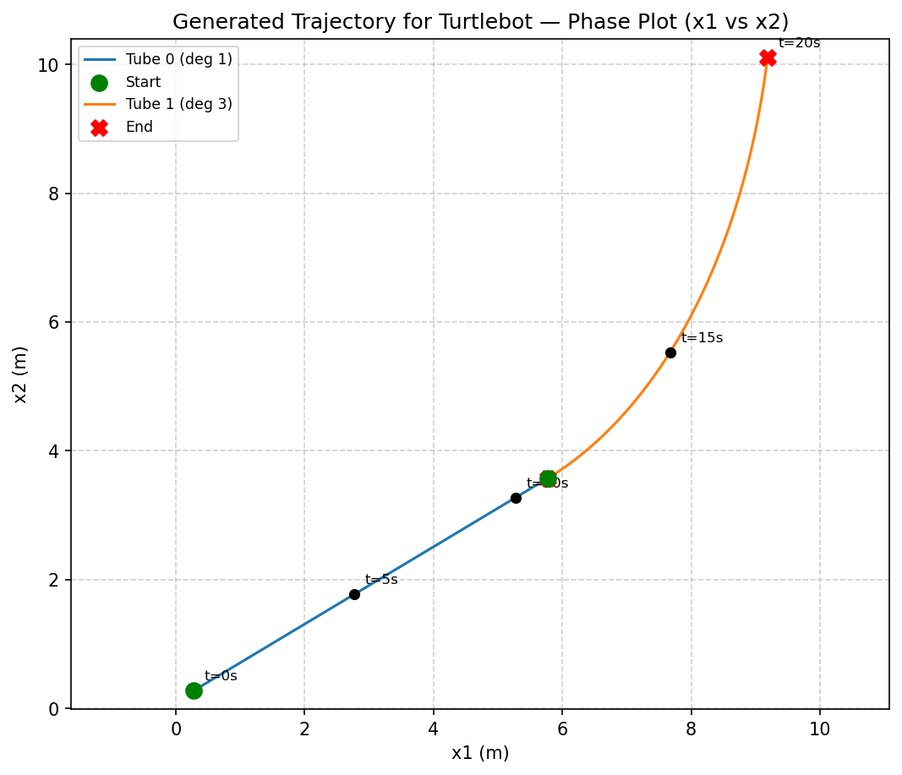
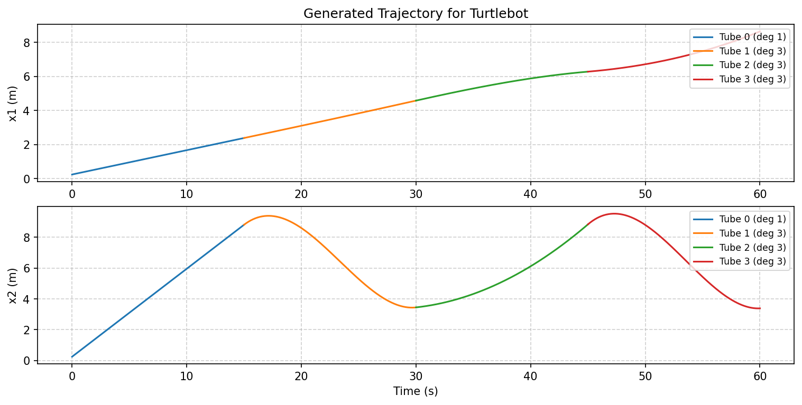
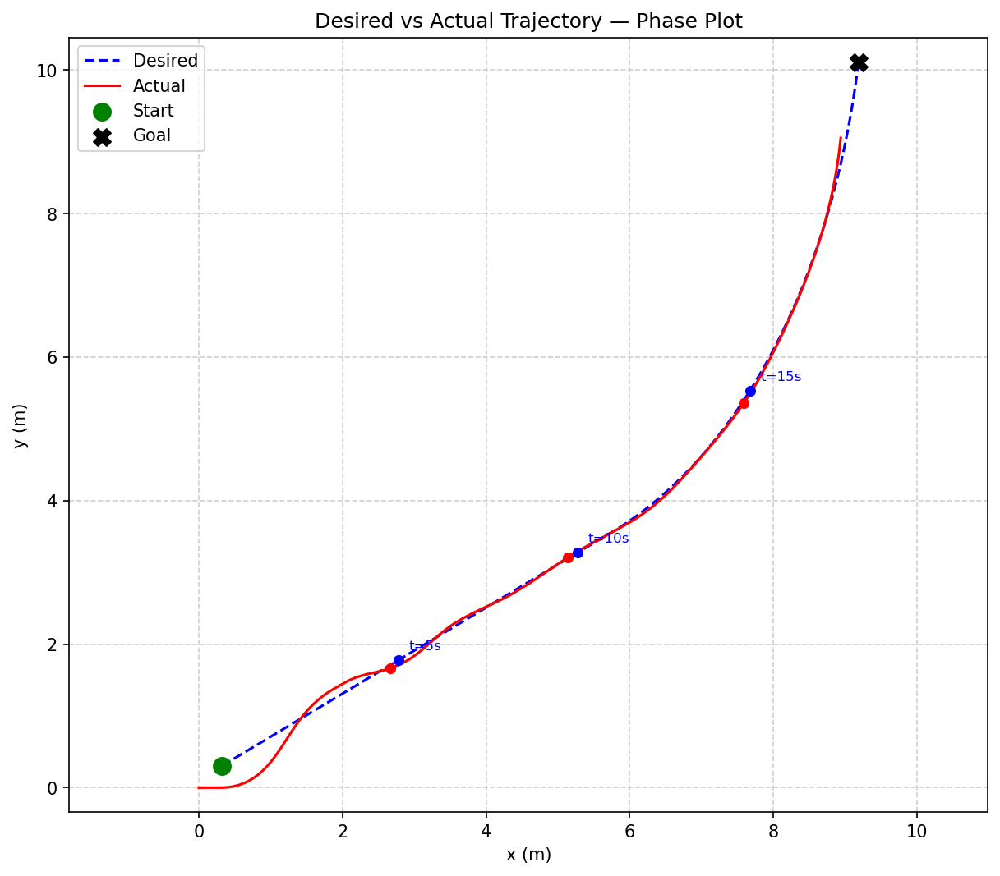
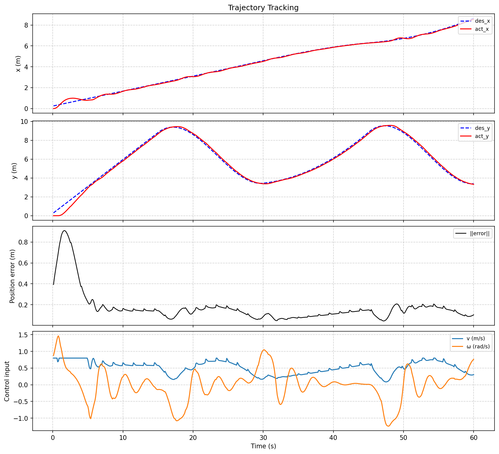

# Path Planning and Control for Differential Drive Dynamics using Spatiotemporal Tubes

## Problem Statement
Robots often receive a coarse path from a global planner, consisting of discrete waypoints. To enable smooth and safe motion, this path must be refined into a continuous, smooth trajectory. Moreover, the robot needs a controller that can account for the kinematic and holonomic constraints and still manage to steer the robot accurately on the smooth path.

## System Definition
In this approach, we cater our solution to Differential Drive dynamics given by the following state space model:
> $\dot x_1 = v \cos \theta$ \
> $\dot x_2 = v \sin \theta$ \
> $\dot \theta = \omega$

where $x_1$, $x_2$ and $\theta$ are state variables while $v$ and $\omega$ are control inputs.

- Given that we have waypoints of the order $[(x_0, y_0), (x_1, y_1),\ldots, (x_n, y_n)]$ we must generate a smooth path that satisfies reachability. Then we should be able to sample the path at regular intervals and assign velocity profiles (e.g., trapezoidal or constant velocity). This will give us a time-stamped trajectory in the form of $[(x_0, y_0, t_0), (x_1, y_1, t_1),\ldots, (x_n, y_n, t_n)]$.

- Finally, our controller has to be robust enough to be able to nudge the robot towards this reference trajectory.

## Approach
This problem closely resembles the framework introduced in [this](https://github.com/SnyprDragun/stt-for-diff-drive?tab=readme-ov-file#reference-article) article which proposes an offline trajectory tracking algorithm called Spatiotemporal Tubes (STTs). 

> _**Quick glance at STTs:** STT is a data-driven approach to solve temporal logic specications for reach-avoid-stay tasks. The specification is often brocken down into smaller constraints and fed into an SMT solver, which provides feasible conditions for satisfiability. While the STT framework has other benefits such as "mathematic guarantees for robot safety", the core idea can be borrowed for low level operations._

- As STTs handle both spatial and temporal constraints, generate smooth paths robustly, and also offer their own control law, it perfectly fits our current problem statement.
- The only difference lies at the order of operations. Although we were assigning velocity profiles only after we had a feasible path, STTs do this all at once. The only assumption is that the tube is slow enough for the robot's kinematic limitations. This is analogous to how we would assign a velocity profile by maintaining robot actuation feasibility. 

## System Requirements
- Ubuntu 22.04 LTS Jammy Jellyfish
- C++14 or greater
- Python 3.10 or greater
- ROS2 Humble Hawksbill
- Turtlebot3
- Numpy, Matplotlib, PyTorch, Z3, Mpl_toolkits

## Methodology
We have two phases for this implementation:

**Phase-1:** Tube Generation
- The python files inside `src` can be used to generate STT for any given temporal reach-avoid task. 
- `main.py` is the primary executable where the specification has to be mentioned. Running this file saves the generated tube coefficients into `config/coeffeicients.csv`. Usage: Run `python3 src/main.py` from package root.
- In the current example, small tube sections satisfying one reach setpoint, have been joined to accomplish the overall specification. But the design is robust enough to have one continuous tube for the entire task. Only drawback is increment in computation time.
- Once the tubes are ready, we can move on to simulation directly.

**Phase-2:** Simulation
- The ROS files are inside `src/scripts`. `main.cpp` is our executable and initializes the ros node for turtlebot3. 
- `turtlebot_node.cpp` directly sources the `config/coeffeicients.csv` file to load the reference trajectory.
- Before running the simulation we have to ensure that the timestamps used for tube generation matches those in the `turtlebot_node.hpp` file. For now there is no direct transfer of this parameter and has to be handcoded.
- Steps are launching turtlebot in empty gazebo world and then running 
    ```
    ros2 run stt-for-diff-drive turtlebot_node
    ```
- To see the plots of how the simulated trajectory fared against the reference path, run `plot_trajectory.py`.
- All the plots can also be found in the `\media` folder.

## Trajectory Generation



## Simulation 



## Reference Article
```bibtex
@misc{das2025spatiotemporaltubesdifferentialdrive,
    title={Spatiotemporal Tubes for Differential Drive Robots with Model Uncertainty}, 
    author={Ratnangshu Das and Ahan Basu and Christos Verginis and Pushpak Jagtap},
    year={2025},
    eprint={2512.05495},
    archivePrefix={arXiv},
    primaryClass={cs.RO},
    url={https://arxiv.org/abs/2512.05495}, 
}
```
